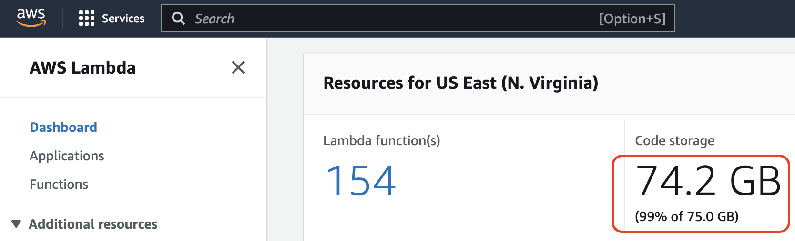
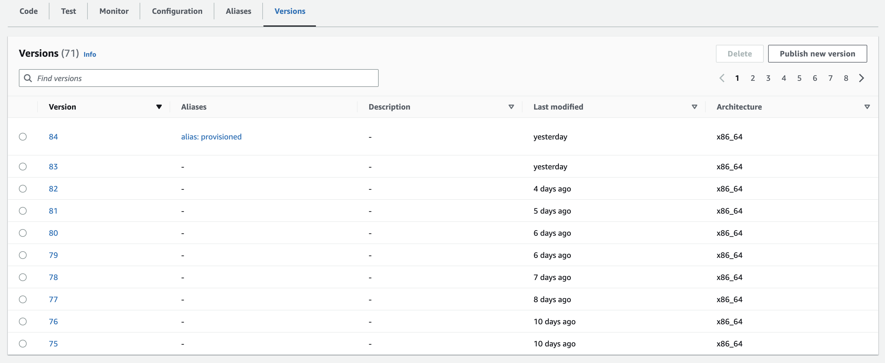
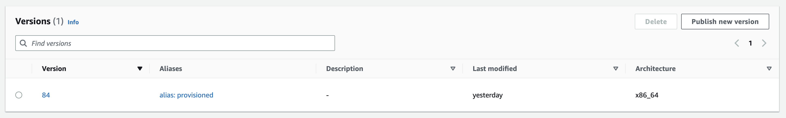

Other day, my team mate reported this error in Gitlab pipeline:

```
╷
│ Error: updating Lambda Function (page-lambda-us-east-1) code: operation error Lambda: UpdateFunctionCode, https response error StatusCode: 400, RequestID: c4b4d69f-91d1-49e5-8934-55dcae38cffa, CodeStorageExceededException: Code storage limit exceeded.
│
│   with aws_lambda_function.nextjs_lambda,
│   on main.tf line 15, in resource "aws_lambda_function" "nextjs_lambda":
│   15: resource "aws_lambda_function" "nextjs_lambda" {
│
╵
```

From the error message, we can understand that some storage space got full. In this case, it is the storage space of AWS Lambda. **AWS lambda stores the function code in an internal S3 bucket that is private to your account. Each AWS account is allocated with 75GB of storage in each region.**

> Note: The 75GB storage is not for each lambda. It is for all the lambda functions together.

## Finding Lambda Storage Capacity in AWS Console

To check if we have exceeded, we logged in to AWS account and selected the correct region. Under **AWS Lambda > Dashboard**, we can see the storage utilization.



It was 75.3GB when we got the error. This screenshot was taken after freeing some space.

## Why it happened?

In my case, versioning was enabled for few lambda functions. In each deployment, a new version is formed. This increased the disk space utilization.

Here is a function that has 80+ versions.



Ideally, I did not have to keep all these versions. Maximum the last two versions needs to be kept.

## Deleting Versions from Console

To free up some space, we can select a version by clicking the radio button and click "Delete" button on top right.

In my case for every 4 versions deleted, I could save 100MB of storage. If your function is big, you can free more space in each deletion.

But I got bored after deleting few versions. This task will take forever.

## Deleting Versions using AWS CLI

I searched in Google and found the command to delete a version from command line.

The steps to do that are easy. First, we need to install aws-sdk. That will bring `aws` command available in our terminal.

Then set AWS client ID and AWS secret.

Then run below command to delete a version:

```
aws lambda delete-function --function-name <function-name> --region us-east-1 --qualifier <version number>
```

Eg:

```
aws lambda delete-function --function-name my-lambda-function --region us-east-1 --qualifier 83
```

Above command deletes version `83` of `my-lambda-function`.

This process was faster than console. Still, I had to do it for each version.

## Deleting all Older versions of Lambda Function in loop

If I could delete all the older version numbers in a loop, I can save a lot of time.

So, I created a bash script with loop. The boilerplate for the script was taken from ChatGPT.

Here is the bash script that loop from 82 to 1 and delete one version in each iteration.

```bash
#!/bin/bash

# Define the loop counter and maximum iterations
counter=82
end=0

# Start the loop
while [ $counter -ge $end ]
do
  # Run your AWS CLI command here
  aws lambda delete-function --function-name your-function-name --region us-east-1 --qualifier $counter

  # Increment the counter
  counter=$((counter-1))

  # Sleep for a desired interval (optional)
  sleep 1
done
```

I saved the file as `lambda.sh`. Then I tried to run the file from terminal using `./lambda.sh`.

It returned permission denied error. I fixed it using `chmod +x lambda.sh` command.

Then I retried running `lambda.sh`.

The terminal was processing the loop for several minutes. After that, I got the terminal prompt back.

I immediately went to AWS console and checked if the older versions got deleted. WOW! all of them are gone!.



Just doing that for one lambda saved 1GB for me. I am happy :)

Next, you can check how can to pass an array of lambda function names and delete all older versions.
