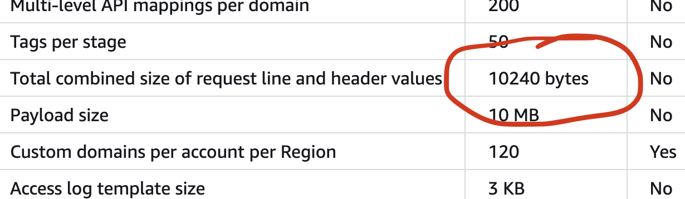

In my current project, when we moved a page to different architecture, we were seeing status code 431 sometimes from Cloudflare.

## What was be the cause?

From a quick analysis, it looks like this was happening as the cookie size is increasing over time. Cookies are part of request header. So, more cookies and bigger cookie values result in bigger request header.

Somebody did not like a big request header.

In my case, we were using Cloudflare for a long time. So Cloudflare is not the problem. But as part of the new architecture, the new entry was **AWS API gateway**. And he is the villain.

## More on AWS API Gateway

An AWS API gateway has a hard limit for request header size of **10kb**. You can read more [here](https://docs.aws.amazon.com/apigateway/latest/developerguide/limits.html).

## How to fix it

One option is to filter the cookies sent to API Gateway. In my case, I could use this solution because customers are first hitting Cloudflare. Cloudflare is then making call to the API gateway.

So using Cloudflare worker, I could filter the unncessary cookies before sending to the API gateway origin.

Second option is to use AWS cloudfront. The cloudfront url has much greater request header limit. But that comes with a cost. In my case, since we are using Cloudflare as our CDN, we did not go with second route.
