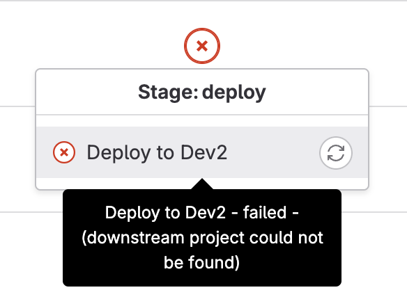

In my current e-commerce project, each main pages like home, plp, pdp etc are a separate project in itself. Each project has got a separate repo in Gitlab.

I was trying to have a core central Git repo, that controls of deployment of other repos. This helps in managing deployment from one location.

To implement the same, I tried [Multi-project pipelines](https://docs.gitlab.com/ee/ci/pipelines/downstream_pipelines.html#multi-project-pipelines) in Gitlab.

## Linking Projects

In the parent / main repo, I have a `.gitlab-ci.yml` that has below contents:

```yml
stages:
  - deploy

Deploy to Dev:
  stage: deploy
  rules:
    - if: $CI_COMMIT_REF_NAME =~ /^release\//
  trigger:
    project: company/group/home-page
    branch: dev

Deploy to QA:
  stage: deploy
  rules:
    - if: $CI_COMMIT_REF_NAME =~ /^release\//
  trigger:
    project: company/group/home-page
    branch: qa
```

Above code is the final working yml file. When I started after reading the Gitlab documentation, I was giving only `group/home-page` as the `project` value. That resulted in error saying "failed-downstream project could not be found".



In my case, what I had to do was to give _workspace_ name also. So when I gave the complete project path that comes after `gitlab.com` in the url, things started working.

So if your child Gitlab project repo url is `https://gitlab.com/apple/iphone/operating-system`, the value of `project` should be `apple/iphone/operating-system`.

There might be other reasons behind the error. But this is the solution that worked for me.
