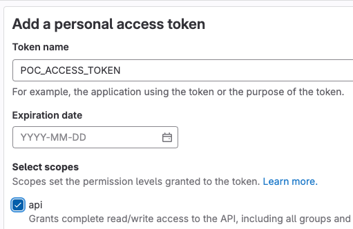

Even though I am using Gitlab on a daily basis, I am new to its API. As part of learning it, I have create a new repo in Gitlab.

Then placed a `.gitlab-ci.yml` file with below content:

```
child-job:
  script:
    - echo "Hello, Child!"
```

This code just triggers pipeline if we push to any branch in the repo. It will log `Hello, Child!` in the job console.

Here is the API documentation [link](https://docs.gitlab.com/ee/api/pipelines.html#create-a-new-pipeline) that creates a new pipeline.

## API Endpoint

Here is the API endpoint to create a new pipeline.

```
https://gitlab.example.com/api/v4/projects/<project id here>/pipeline?ref=<branch name here>
```

Project id will be a number that looks like `78547896`. Branch name is the branch for which you want the pipeline to run.

## Access Token

To run the project you need an access token. Visit the [access token page](https://gitlab.com/-/profile/personal_access_tokens) to create a new token. The scope can be set as `api`. You can also set how long the token needs to active.



## API Execution

Once we call the API endpoint as a POST request and pass the PRIVATE-TOKEN header, a new pipeline will be created. We can also verify in the project page. There we can see a new pipeline started.
