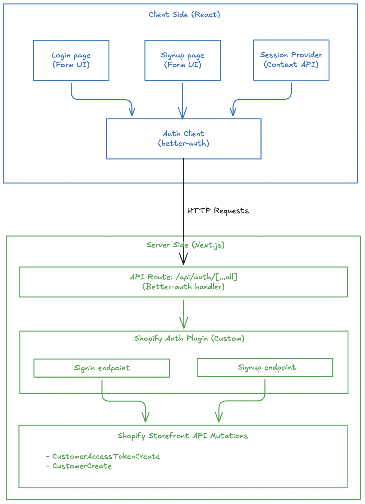

Authentication is a critical component of any e-commerce application. When building a headless Shopify storefront with Next.js, you need a robust authentication solution that integrates seamlessly with Shopify's customer API. In this article, we'll explore how to implement authentication using **Better-Auth**, a modern authentication library for Next.js applications.

**Live Demo:** [https://headless-shopify-site.vercel.app/](https://headless-shopify-site.vercel.app/)

## What is Better-Auth?

[Better-Auth](https://www.better-auth.com/) is a flexible, type-safe authentication library for Next.js that provides a plugin-based architecture. It offers:

- 🔐 Type-safe authentication flows
- 🔌 Plugin-based extensibility
- 🍪 Secure cookie-based session management
- 📦 Built-in Next.js integration
- 🎯 Developer-friendly API

## Why Better-Auth for Shopify?

When building a headless Shopify storefront, you need to integrate with Shopify's Customer API for authentication. Better-Auth's plugin system makes it perfect for this use case because:

1. **Custom Plugin Support**: Create a custom Shopify authentication plugin that wraps Shopify's Customer API
2. **Next.js Integration**: Built-in support for Next.js App Router and API routes
3. **Secure Cookie Management**: Handles access token storage securely with HTTP-only cookies
4. **Type Safety**: Full TypeScript support for authentication flows

## Architecture Overview

Our authentication implementation consists of several key components:



## Prerequisites

Before implementing authentication with Better-Auth, ensure you have:

1. **Next.js Setup**: A working Next.js application (App Router or Pages Router)
2. **Shopify Integration**: Logic to execute Shopify customer mutations (`customerAccessTokenCreate`, `customerCreate`, etc.) via Shopify's Storefront API

This article focuses specifically on integrating Better-Auth with Shopify and does not cover Next.js setup or Shopify API integration basics.

## Step 1: Install Better-Auth

First, install the required dependencies:

```bash
pnpm add better-auth
# or
npm install better-auth
# or
yarn add better-auth
```

## Step 2: Configure Environment Variables

Add the required environment variable for Better-Auth:

```env
# .env
BETTER_AUTH_SECRET=your_secret_key_here
```

Generate a secure secret key using:

```bash
openssl rand -base64 32
```

Your project might have other environment variables like Shopify Graphql endpoint, storefront access token. I am not writing everything here to stick to the auth logic.

## Step 3: Create the Shopify Auth Plugin (Server)

The Shopify auth plugin is the heart of our authentication system. It creates custom endpoints that integrate with Shopify's Customer API.

### Define Input Types

First, define TypeScript types for sign-in and sign-up inputs:

```typescript
// src/lib/shopify-auth-plugin.ts
export type ShopifySignInInput = {
  email: string;
  password: string;
};

export type ShopifySignUpInput = {
  email: string;
  password: string;
  firstName?: string;
  lastName?: string;
  acceptsMarketing?: boolean;
  autoSignIn?: boolean;
};
```

You might not need this if you are not using TypeScript.

### Setup Validation Schemas

Use Zod to validate incoming requests:

```typescript
import * as z from "zod";

const signInSchema = z.object({
  email: z.email().min(1),
  password: z.string().min(1),
});

const signUpSchema = z.object({
  email: z.email().min(1),
  password: z.string().min(1),
  firstName: z.string().min(1).optional(),
  lastName: z.string().min(1).optional(),
  acceptsMarketing: z.boolean().optional(),
  autoSignIn: z.boolean().optional(),
});
```

Zod is optional. You can skip this if you are not concerned about input validation. Not a mandatory thing for better-auth.

### Create the Sign-In Endpoint

The sign-in endpoint calls Shopify's `customerAccessTokenCreate` mutation and stores the token in an HTTP-only cookie:

```typescript
import { APIError, createAuthEndpoint } from "better-auth/api";

const SHOPIFY_CUSTOMER_TOKEN_COOKIE = "shopifyCustomerAccessToken";

export const shopifyAuthPlugin = () => {
  return {
    id: "shopify-auth",
    endpoints: {
      signIn: createAuthEndpoint(
        "/shopify-auth/sign-in",
        {
          method: "POST",
          body: signInSchema,
        },
        async (ctx) => {
          const { email, password } = ctx.body;

          // Call Shopify's customer access token create mutation
          const result = await customerAccessTokenCreate({ email, password });

          if (!result) {
            throw new APIError("BAD_REQUEST", {
              message: "Shopify sign-in failed.",
            });
          }

          // Extract token and errors from response
          const payload = result.customerAccessTokenCreate;
          const userErrors = payload?.customerUserErrors ?? [];
          const token = payload?.customerAccessToken?.accessToken;
          const expiresAt = payload?.customerAccessToken?.expiresAt;

          if (userErrors.length || !token) {
            throw new APIError("UNAUTHORIZED", {
              message: userErrors[0]?.message || "Invalid email or password.",
            });
          }

          // Store token in secure HTTP-only cookie
          ctx.setCookie(SHOPIFY_CUSTOMER_TOKEN_COOKIE, token, {
            httpOnly: true,
            secure: process.env.NODE_ENV === "production",
            sameSite: "lax",
            path: "/",
            expires: expiresAt ? new Date(expiresAt) : undefined,
          });

          return ctx.json({ ok: true });
        },
      ),
      // ... signUp endpoint
    },
  };
};
```

The sign-in flow:

1. Validates email and password using Zod
2. Calls Shopify's `customerAccessTokenCreate` mutation
3. Checks for errors in the response
4. Stores the access token in an HTTP-only cookie
5. Returns success response

I have not given the details of `customerAccessTokenCreate()` function to keep this article stick to auth related logic. You can visit the Github repo of headless-shopify to get that function and see how it works.

### Create the Sign-Up Endpoint

This section should go inside the `endpoints` object, just like `signIn`.

The sign-up endpoint creates a new customer in Shopify and optionally signs them in:

```typescript
signUp: createAuthEndpoint(
  "/shopify-auth/sign-up",
  {
    method: "POST",
    body: signUpSchema,
  },
  async (ctx) => {
    const { email, password, firstName, lastName, acceptsMarketing, autoSignIn } = ctx.body;

    // Create customer in Shopify
    const result = await customerCreate({
      email,
      password,
      firstName,
      lastName,
      acceptsMarketing,
    });

    const payload = result.customerCreate;
    const userErrors = payload?.customerUserErrors ?? [];
    const customer = payload?.customer;

    if (userErrors.length || !customer) {
      throw new APIError("BAD_REQUEST", {
        message: userErrors[0]?.message || "Unable to create customer.",
      });
    }

    // Optionally sign in the user immediately after signup
    if (autoSignIn) {
      const signInResult = await customerAccessTokenCreate({ email, password });
      const token = signInResult?.customerAccessTokenCreate?.customerAccessToken?.accessToken;

      if (token) {
        ctx.setCookie(SHOPIFY_CUSTOMER_TOKEN_COOKIE, token, {
          httpOnly: true,
          secure: process.env.NODE_ENV === "production",
          sameSite: "lax",
          path: "/",
        });
      }
    }

    return ctx.json({ ok: true, customer });
  },
),
```

The sign-up flow:

1. Validates all input fields using Zod
2. Calls Shopify's `customerCreate` mutation
3. Handles any errors from Shopify
4. If `autoSignIn` is true, immediately signs in the user
5. Returns success with customer data

## Step 4: Configure Better-Auth Server

Create the Better-Auth server instance:

```typescript
// src/lib/auth.ts
import { betterAuth } from "better-auth";
import { nextCookies } from "better-auth/next-js";
import { shopifyAuthPlugin } from "@/lib/shopify-auth-plugin";

export const auth = betterAuth({
  plugins: [nextCookies(), shopifyAuthPlugin()],
});
```

## Step 5: Create API Route Handler

Create a catch-all API route for Better-Auth:

```typescript
// src/app/api/auth/[...all]/route.ts
import { auth } from "@/lib/auth";
import { toNextJsHandler } from "better-auth/next-js";

export const { GET, POST } = toNextJsHandler(auth);
```

This creates the following endpoints:

- `POST /api/auth/shopify-auth/sign-in` - Sign in
- `POST /api/auth/shopify-auth/sign-up` - Sign up

## Step 6: Create Client-Side Auth Plugin

A better-auth client-side plugin consumes the APIs created by server-side plugin.

Create the client-side plugin:

```typescript
// src/lib/shopify-auth-client.ts
import type { BetterAuthClientPlugin } from "better-auth/client";
import type { BetterFetchOption } from "@better-fetch/fetch";
import type {
  shopifyAuthPlugin,
  ShopifySignInInput,
  ShopifySignUpInput,
} from "@/lib/shopify-auth-plugin";

export const shopifyAuthClientPlugin = () => {
  return {
    id: "shopify-auth",
    $InferServerPlugin: {} as ReturnType<typeof shopifyAuthPlugin>,
    getActions: ($fetch) => {
      return {
        shopifySignIn: async (
          data: ShopifySignInInput,
          fetchOptions?: BetterFetchOption,
        ) => {
          return $fetch("/shopify-auth/sign-in", {
            method: "POST",
            body: data,
            ...fetchOptions,
          });
        },
        shopifySignUp: async (
          data: ShopifySignUpInput,
          fetchOptions?: BetterFetchOption,
        ) => {
          return $fetch("/shopify-auth/sign-up", {
            method: "POST",
            body: data,
            ...fetchOptions,
          });
        },
      };
    },
  } satisfies BetterAuthClientPlugin;
};
```

## Step 7: Initialize Auth Client

Create the auth client instance:

```typescript
// src/lib/auth-client.ts
import { createAuthClient } from "better-auth/react";
import { shopifyAuthClientPlugin } from "@/lib/shopify-auth-client";

export const authClient = createAuthClient({
  plugins: [shopifyAuthClientPlugin()],
});
```

## Step 8: Create Login Page

Now let's build the login UI that uses our auth client.

### Setup Component State

```tsx
// src/app/account/login/page.tsx
"use client";

import React, { useState } from "react";
import { authClient } from "@/lib/auth-client";
import { useRouter } from "next/navigation";

export default function LoginPage() {
  const [loading, setLoading] = useState(false);
  const [error, setError] = useState<string | null>(null);
  const router = useRouter();
  // ... form handler
}
```

### Handle Form Submission

The form handler calls the `shopifySignIn` method from our auth client:

```tsx
async function onSubmit(e: React.FormEvent<HTMLFormElement>) {
  e.preventDefault();
  setError(null);
  setLoading(true);

  const form = e.currentTarget;
  const email = (form.elements.namedItem("email") as HTMLInputElement).value;
  const password = (form.elements.namedItem("password") as HTMLInputElement)
    .value;

  try {
    const shopifyAuth = await authClient.shopifySignIn({
      email,
      password,
    });

    // Check for errors in the response
    const shopifyError = (shopifyAuth as { error?: { message?: string } })
      ?.error?.message;
    if (shopifyError) {
      setError(shopifyError || "Invalid email or password.");
      return;
    }

    // Verify successful sign-in
    const shopifyData = (shopifyAuth as { data?: { ok?: boolean } })?.data;
    if (!shopifyData?.ok) {
      setError("Invalid email or password.");
      return;
    }

    // Redirect to account page on success
    router.push("/account");
  } catch (err) {
    setError("An error occurred. Please try again.");
  } finally {
    setLoading(false);
  }
}
```

### Render the Form

Create a simple, accessible form:

```tsx
return (
  <div className="max-w-md mx-auto mt-8 p-6">
    <h1 className="text-2xl font-bold mb-6">Sign In</h1>

    <form onSubmit={onSubmit} className="space-y-4">
      <div>
        <label htmlFor="email" className="block text-sm font-medium mb-2">
          Email
        </label>
        <input
          id="email"
          name="email"
          type="email"
          required
          className="w-full px-3 py-2 border rounded-md"
        />
      </div>

      <div>
        <label htmlFor="password" className="block text-sm font-medium mb-2">
          Password
        </label>
        <input
          id="password"
          name="password"
          type="password"
          required
          className="w-full px-3 py-2 border rounded-md"
        />
      </div>

      {error && <div className="text-red-600 text-sm">{error}</div>}

      <button
        type="submit"
        disabled={loading}
        className="w-full bg-blue-600 text-white py-2 rounded-md"
      >
        {loading ? "Signing in..." : "Sign In"}
      </button>
    </form>
  </div>
);
```

## Step 8b: Create Signup Page

Similarly, let's create the signup page that allows new users to create accounts.

### Setup Component State

```tsx
// src/app/account/register/page.tsx
"use client";

import React, { useState } from "react";
import { authClient } from "@/lib/auth-client";

export default function RegisterPage() {
  const [loading, setLoading] = useState(false);
  const [error, setError] = useState<string | null>(null);
  // ... form handler
}
```

### Handle Form Submission

The form handler calls `shopifySignUp` with the new customer information:

```tsx
async function onSubmit(e: React.FormEvent<HTMLFormElement>) {
  e.preventDefault();
  setError(null);
  setLoading(true);

  const form = e.currentTarget;
  const firstName = (form.elements.namedItem("firstName") as HTMLInputElement)
    .value;
  const lastName = (form.elements.namedItem("lastName") as HTMLInputElement)
    .value;
  const email = (form.elements.namedItem("email") as HTMLInputElement).value;
  const password = (form.elements.namedItem("password") as HTMLInputElement)
    .value;

  try {
    const shopifyAuth = await authClient.shopifySignUp({
      email,
      password,
      firstName,
      lastName,
      acceptsMarketing: false,
      autoSignIn: true, // Automatically sign in after signup
    });

    // Check for errors
    const shopifyError = (shopifyAuth as { error?: { message?: string } })
      ?.error?.message;
    if (shopifyError) {
      setError(shopifyError || "Unable to create account.");
      return;
    }

    // Verify success
    const shopifyData = (shopifyAuth as { data?: { ok?: boolean } })?.data;
    if (!shopifyData?.ok) {
      setError("Unable to create account.");
      return;
    }

    // Redirect to home page on success
    window.location.href = "/";
  } catch {
    setError("Unable to create account. Please try again.");
  } finally {
    setLoading(false);
  }
}
```

Note the `autoSignIn: true` option - this automatically signs in the user after successful registration, providing a seamless onboarding experience.

### Render the Form

Create a registration form with fields for first name, last name, email, and password:

```tsx
return (
  <div className="max-w-md mx-auto mt-8 p-6">
    <h1 className="text-2xl font-bold mb-6">Create Account</h1>

    <form onSubmit={onSubmit} className="space-y-4">
      <div>
        <label htmlFor="firstName" className="block text-sm font-medium mb-2">
          First Name
        </label>
        <input
          id="firstName"
          name="firstName"
          type="text"
          required
          className="w-full px-3 py-2 border rounded-md"
        />
      </div>

      <div>
        <label htmlFor="lastName" className="block text-sm font-medium mb-2">
          Last Name
        </label>
        <input
          id="lastName"
          name="lastName"
          type="text"
          required
          className="w-full px-3 py-2 border rounded-md"
        />
      </div>

      <div>
        <label htmlFor="email" className="block text-sm font-medium mb-2">
          Email
        </label>
        <input
          id="email"
          name="email"
          type="email"
          required
          className="w-full px-3 py-2 border rounded-md"
        />
      </div>

      <div>
        <label htmlFor="password" className="block text-sm font-medium mb-2">
          Password
        </label>
        <input
          id="password"
          name="password"
          type="password"
          required
          className="w-full px-3 py-2 border rounded-md"
        />
      </div>

      {error && <div className="text-red-600 text-sm">{error}</div>}

      <button
        type="submit"
        disabled={loading}
        className="w-full bg-blue-600 text-white py-2 rounded-md"
      >
        {loading ? "Creating Account..." : "Create Account"}
      </button>
    </form>
  </div>
);
```

## Step 9: Create Session Provider

A session provider manages user authentication state across your application using React Context.

### Define Context Types

```tsx
// src/providers/session-provider.tsx
"use client";

import {
  createContext,
  useCallback,
  useContext,
  useEffect,
  useState,
} from "react";
import { getCurrentUser } from "@/lib/shopify/queries/customers/getCurrentUser";

type SessionUser = Awaited<ReturnType<typeof getCurrentUser>>;

type SessionContextValue = {
  user: SessionUser;
  loading: boolean;
  error: string | null;
  refresh: () => Promise<void>;
};
```

### Create the Provider Component

```tsx
const SessionContext = createContext<SessionContextValue | undefined>(
  undefined,
);

export function SessionProvider({ children }: { children: React.ReactNode }) {
  const [user, setUser] = useState<SessionUser>(null);
  const [loading, setLoading] = useState(true);
  const [error, setError] = useState<string | null>(null);

  const refresh = useCallback(async () => {
    try {
      setLoading(true);
      setError(null);
      const currentUser = await getCurrentUser();
      setUser(currentUser);
    } catch (err) {
      setError(err instanceof Error ? err.message : "Failed to load user");
      setUser(null);
    } finally {
      setLoading(false);
    }
  }, []);

  useEffect(() => {
    refresh();
  }, [refresh]);

  return (
    <SessionContext.Provider value={{ user, loading, error, refresh }}>
      {children}
    </SessionContext.Provider>
  );
}
```

The provider automatically fetches the current user on mount and provides a `refresh` method to reload user data.

### Create a Custom Hook

`useSession()` provides access to session-related data and functionality throughout your application.

```tsx
export function useSession() {
  const context = useContext(SessionContext);
  if (context === undefined) {
    throw new Error("useSession must be used within a SessionProvider");
  }
  return context;
}
```

## Step 10: Use Session in Your App

### Wrap Your App

Add the SessionProvider to your root layout:

```tsx
// src/app/layout.tsx
import { SessionProvider } from "@/providers/session-provider";

export default function RootLayout({
  children,
}: {
  children: React.ReactNode;
}) {
  return (
    <html lang="en">
      <body>
        <SessionProvider>{children}</SessionProvider>
      </body>
    </html>
  );
}
```

### Access User Data

Use the `useSession` hook in any component to access authentication state:

```tsx
"use client";

import { useSession } from "@/providers/session-provider";

export function UserProfile() {
  const { user, loading, error } = useSession();

  if (loading) return <div>Loading...</div>;
  if (error) return <div>Error: {error}</div>;
  if (!user) return <div>Not logged in</div>;

  return (
    <div>
      <h2>Welcome, {user.firstName}!</h2>
      <p>Email: {user.email}</p>
    </div>
  );
}
```

The session hook provides:

- `user` - Current user data or null
- `loading` - Boolean indicating if user data is being fetched
- `error` - Error message if fetching failed
- `refresh()` - Function to manually reload user data

## Key Security Features

### 1. HTTP-Only Cookies

The access token is stored in an HTTP-only cookie, making it inaccessible to JavaScript:

```typescript
ctx.setCookie(SHOPIFY_CUSTOMER_TOKEN_COOKIE, token, {
  httpOnly: true, // Prevents XSS attacks
  secure: process.env.NODE_ENV === "production", // HTTPS only in production
  sameSite: "lax", // CSRF protection
  path: "/",
  expires: expiresAt ? new Date(expiresAt) : undefined,
});
```

### 2. Input Validation

All inputs are validated using Zod schemas before processing:

```typescript
const signInSchema = z.object({
  email: z.email().min(1),
  password: z.string().min(1),
});
```

### 3. Error Handling

Proper error handling prevents information leakage:

```typescript
if (userErrors.length || !token) {
  throw new APIError("UNAUTHORIZED", {
    message: userErrors[0]?.message || "Invalid email or password.",
  });
}
```

## Benefits of This Approach

1. **Type Safety**: Full TypeScript support throughout the authentication flow
2. **Security**: HTTP-only cookies and secure token management
3. **Extensibility**: Plugin-based architecture makes it easy to add features
4. **Developer Experience**: Clean API with minimal boilerplate
5. **Integration**: Seamless integration with Shopify's Customer API
6. **Session Management**: Built-in session handling with React Context

## Conclusion

Implementing authentication in a headless Shopify storefront using Better-Auth provides a secure, type-safe, and developer-friendly solution. The plugin-based architecture allows you to create custom authentication flows that integrate perfectly with Shopify's Customer API while maintaining security best practices.

The complete implementation includes:

- ✅ Custom Better-Auth plugin for Shopify
- ✅ Secure cookie-based session management
- ✅ Sign-in and sign-up functionality
- ✅ Client-side session provider
- ✅ Type-safe authentication flows
- ✅ Error handling and validation

You can find the complete implementation in the [Headless Shopify repository](https://github.com/jobyjoseph/headless-shopify).

## Resources

- [Better-Auth Documentation](https://www.better-auth.com/)
- [Shopify Storefront API Documentation](https://shopify.dev/docs/api/storefront)
- [Headless Shopify Project](https://github.com/jobyjoseph/headless-shopify)
