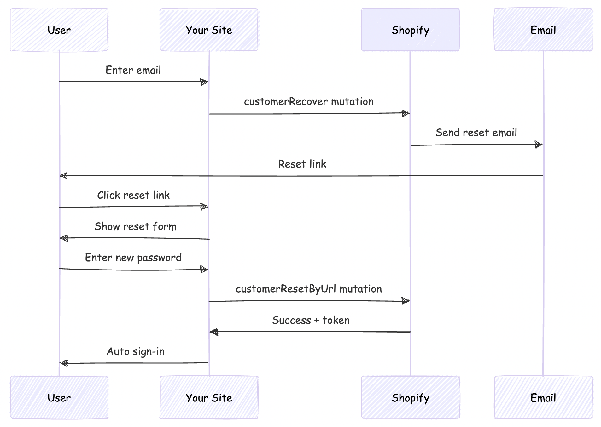

Password recovery is an essential feature for any e-commerce application. When users forget their passwords, they need a secure and straightforward way to reset them. In this article, we'll implement a complete forgot password and reset password flow for a headless Shopify storefront using **Better-Auth** and **Next.js**.

**Live Demo:** [https://headless-shopify-site.vercel.app/](https://headless-shopify-site.vercel.app/)

## Prerequisites

This article builds upon the authentication system covered in [Authentication in Headless Shopify Using Better-Auth and Next.js](/blog/implementing-authentication-headless-shopify-better-auth). Make sure you have:

1. ✅ Next.js application with Better-Auth configured
2. ✅ Shopify Customer API integration
3. ✅ Custom Shopify auth plugin implemented
4. ✅ Sign-in and sign-up functionality working

## Understanding Shopify's Password Recovery Flow

Shopify provides two mutations for password recovery:

1. **`customerRecover`**: Sends a password reset email to the customer
2. **`customerResetByUrl`**: Resets the password using the URL from the email

The flow works like this:



## Reset Password Email URL

> This scenario is applicable only if your headless site domain is different from that given as primary domain in Shopify

By default, Shopify's password reset emails point to the Shopify-hosted store (`your-store.myshopify.com`). For a headless storefront, we need these emails to point to **your custom domain** instead.

We'll solve this by:
1. Customizing Shopify's email templates (discussed later in this post)
2. Implementing a reset password page on our site
3. Handling the reset flow with Better-Auth

## Step 1: Create the Forgot Password GraphQL Mutation

First, create the GraphQL mutation file for `customerRecover`:

```graphql
# src/integrations/shopify/customer-recover/customer-recover.shopify.graphql
mutation customerRecover($email: String!) {
  customerRecover(email: $email) {
    customerUserErrors {
      message
      field
    }
  }
}
```

This mutation triggers Shopify to send a password reset email to the customer.

## Step 2: Create the Integration Function

Create the TypeScript integration function:

```typescript
// src/integrations/shopify/customer-recover/index.ts
import {
  CustomerRecoverDocument,
  CustomerRecoverMutation,
  CustomerRecoverMutationVariables,
} from "@/generated/shopifySchemaTypes";
import createApolloClient from "@/integrations/shopify/shopify-apollo-client";

export const customerRecover = async (
  email: string,
): Promise<CustomerRecoverMutation | undefined> => {
  try {
    const client = createApolloClient();
    const { data } = await client.mutate<
      CustomerRecoverMutation,
      CustomerRecoverMutationVariables
    >({
      mutation: CustomerRecoverDocument,
      variables: { email },
    });

    if (!data) {
      throw new Error("No data returned from customerRecover mutation");
    }

    return data;
  } catch (error) {
    console.error("Error sending password reset email:", error);
  }
};
```

**Note:** Run your GraphQL codegen after creating the mutation file:

```bash
npm run codegen
```

## Step 3: Add Forgot Password to Better-Auth Plugin

Update your Shopify auth plugin to include the forgot password endpoint:

### Add Types

```typescript
// src/lib/shopify-auth-plugin.ts
export type ShopifyForgotPasswordInput = {
  email: string;
};
```

### Add Validation Schema

```typescript
import * as z from "zod";

const forgotPasswordSchema = z.object({
  email: z.email().min(1),
});
```

### Create the Endpoint

```typescript
import { customerRecover } from "@/integrations/shopify/customer-recover";

export const shopifyAuthPlugin = () => {
  return {
    id: "shopify-auth",
    endpoints: {
      // ... existing signIn and signUp endpoints
      
      forgotPassword: createAuthEndpoint(
        "/shopify-auth/forgot-password",
        {
          method: "POST",
          body: forgotPasswordSchema,
        },
        async (ctx) => {
          const { email } = ctx.body;

          const result = await customerRecover(email);

          if (!result) {
            throw new APIError("BAD_REQUEST", {
              message: "Unable to send password reset email.",
            });
          }

          const payload = result.customerRecover;
          const userErrors = payload?.customerUserErrors ?? [];

          if (userErrors.length) {
            throw new APIError("BAD_REQUEST", {
              message:
                userErrors[0]?.message ||
                "Unable to send password reset email.",
            });
          }

          return ctx.json({ ok: true });
        },
      ),
    },
  } satisfies BetterAuthPlugin;
};
```

## Step 4: Add Client-Side Action

Update your auth client plugin to expose the forgot password action:

```typescript
// src/lib/shopify-auth-client.ts
import type {
  ShopifyForgotPasswordInput,
} from "@/lib/shopify-auth-plugin";

export const shopifyAuthClientPlugin = () => {
  return {
    id: "shopify-auth",
    $InferServerPlugin: {} as ReturnType<typeof shopifyAuthPlugin>,
    getActions: ($fetch) => {
      return {
        // ... existing shopifySignIn and shopifySignUp
        
        shopifyForgotPassword: async (
          data: ShopifyForgotPasswordInput,
          fetchOptions?: BetterFetchOption,
        ) => {
          return $fetch("/shopify-auth/forgot-password", {
            method: "POST",
            body: data,
            ...fetchOptions,
          });
        },
      };
    },
  } satisfies BetterAuthClientPlugin;
};
```

## Step 5: Create the Forgot Password Page

Create a user-friendly forgot password page:

```tsx
// src/app/account/forgot-password/page.tsx
"use client";

import React, { useState } from "react";
import Link from "next/link";
import { authClient } from "@/lib/auth-client";

export default function ForgotPasswordPage() {
  const [loading, setLoading] = useState(false);
  const [error, setError] = useState<string | null>(null);
  const [success, setSuccess] = useState(false);

  async function onSubmit(e: React.FormEvent<HTMLFormElement>) {
    e.preventDefault();
    setError(null);
    setSuccess(false);
    setLoading(true);

    const form = e.currentTarget;
    const email = (form.elements.namedItem("email") as HTMLInputElement).value;

    try {
      const result = await authClient.shopifyForgotPassword({ email });

      const shopifyError = (result as { error?: { message?: string } })?.error
        ?.message;
      if (shopifyError) {
        setError(shopifyError || "Unable to send password reset email.");
        return;
      }

      const shopifyData = (result as { data?: { ok?: boolean } })?.data;
      if (!shopifyData?.ok) {
        setError("Unable to send password reset email.");
        return;
      }

      setSuccess(true);
    } catch {
      setError("Unable to send password reset email. Please try again.");
    } finally {
      setLoading(false);
    }
  }

  return (
    <div className="border-box px-5 py-8 lg:px-10 min-h-[60vh] flex items-center justify-center">
      <div className="w-full max-w-md">
        <h1 className="text-2xl font-semibold text-gray-900 text-center mb-4">
          Forgot Password
        </h1>
        <p className="text-gray-500 text-center mb-8 font-light">
          Enter your email address and we'll send you a link to reset your
          password.
        </p>

        {success ? (
          <div className="bg-green-50 border border-green-200 text-green-800 px-4 py-3 rounded">
            <p className="text-sm">
              If an account exists with this email, you will receive a password
              reset link shortly.
            </p>
          </div>
        ) : (
          <form className="flex flex-col gap-4" onSubmit={onSubmit}>
            <div className="flex flex-col gap-2">
              <label htmlFor="email" className="text-gray-900">
                Email
              </label>
              <input
                type="email"
                id="email"
                name="email"
                className="border border-gray-200 px-4 py-2 text-gray-900 focus:outline-none focus:border-gray-400"
                placeholder="you@example.com"
                required
              />
            </div>

            {error && (
              <p className="text-sm text-red-600" role="alert">
                {error}
              </p>
            )}

            <button
              type="submit"
              disabled={loading}
              className="mt-4 bg-gray-900 text-white py-3 px-4 hover:bg-gray-800 transition-colors cursor-pointer uppercase disabled:opacity-50 disabled:cursor-not-allowed"
            >
              {loading ? "Sending..." : "Send Reset Link"}
            </button>
          </form>
        )}

        <div className="mt-6 flex flex-col items-center gap-4">
          <Link
            href="/account/login"
            className="text-gray-600 hover:text-gray-900 font-light"
          >
            Back to Login
          </Link>
        </div>
      </div>
    </div>
  );
}
```

## Step 6: Customize Shopify Email Template

This is the crucial step that redirects users to your site instead of Shopify's hosted store.

### Access Email Templates

1. Go to your **Shopify Admin**
2. Navigate to **Settings** → **Notifications**
3. Find **Customer account password reset**
4. Click to edit the template

### Update the Reset URL

Find the line containing the reset password link (typically):

```liquid
{{ customer.reset_password_url }}
```

Replace it with:

```liquid
https://your-vercel-domain.com/account/reset-password?url={{ customer.reset_password_url | url_encode }}
```

**Example:**

```liquid
<!-- Before -->
<a href="{{ customer.reset_password_url }}">Reset your password</a>

<!-- After -->
<a href="https://headless-shopify-site.vercel.app/account/reset-password?url={{ customer.reset_password_url | url_encode }}">Reset your password</a>
```

Replace `headless-shopify-site.vercel.app` with your actual domain.

## Step 7: Implement Password Reset Functionality

Now implement the actual password reset page that users land on after clicking the email link.

### Create the GraphQL Mutation

```graphql
# src/integrations/shopify/customer-reset-by-url/customer-reset-by-url.shopify.graphql
mutation customerResetByUrl($password: String!, $resetUrl: URL!) {
  customerResetByUrl(password: $password, resetUrl: $resetUrl) {
    customer {
      id
      email
      firstName
      lastName
    }
    customerAccessToken {
      accessToken
      expiresAt
    }
    customerUserErrors {
      message
      field
    }
  }
}
```

### Create the Integration Function

```typescript
// src/integrations/shopify/customer-reset-by-url/index.ts
import {
  CustomerResetByUrlDocument,
  CustomerResetByUrlMutation,
  CustomerResetByUrlMutationVariables,
} from "@/generated/shopifySchemaTypes";
import createApolloClient from "@/integrations/shopify/shopify-apollo-client";

export const customerResetByUrl = async (
  password: string,
  resetUrl: string,
): Promise<CustomerResetByUrlMutation | undefined> => {
  try {
    const client = createApolloClient();
    const { data } = await client.mutate<
      CustomerResetByUrlMutation,
      CustomerResetByUrlMutationVariables
    >({
      mutation: CustomerResetByUrlDocument,
      variables: { password, resetUrl },
    });

    if (!data) {
      throw new Error("No data returned from customerResetByUrl mutation");
    }

    return data;
  } catch (error) {
    console.error("Error resetting password:", error);
  }
};
```

Run codegen again:

```bash
npm run codegen
```

## Step 8: Add Reset Password to Auth Plugin

### Add Types

```typescript
// src/lib/shopify-auth-plugin.ts
export type ShopifyResetPasswordInput = {
  password: string;
  resetUrl: string;
};
```

### Add Validation Schema

```typescript
const resetPasswordSchema = z.object({
  password: z.string().min(5),
  resetUrl: z.string().url(),
});
```

### Create the Endpoint

```typescript
import { customerResetByUrl } from "@/integrations/shopify/customer-reset-by-url";

export const shopifyAuthPlugin = () => {
  return {
    id: "shopify-auth",
    endpoints: {
      // ... existing endpoints
      
      resetPassword: createAuthEndpoint(
        "/shopify-auth/reset-password",
        {
          method: "POST",
          body: resetPasswordSchema,
        },
        async (ctx) => {
          const { password, resetUrl } = ctx.body;

          const result = await customerResetByUrl(password, resetUrl);

          if (!result) {
            throw new APIError("BAD_REQUEST", {
              message: "Unable to reset password.",
            });
          }

          const payload = result.customerResetByUrl;
          const userErrors = payload?.customerUserErrors ?? [];
          const token = payload?.customerAccessToken?.accessToken;
          const expiresAt = payload?.customerAccessToken?.expiresAt;

          if (userErrors.length || !token) {
            throw new APIError("BAD_REQUEST", {
              message: userErrors[0]?.message || "Unable to reset password.",
            });
          }

          // Auto sign-in after successful password reset
          ctx.setCookie(SHOPIFY_CUSTOMER_TOKEN_COOKIE, token, {
            httpOnly: true,
            secure: process.env.NODE_ENV === "production",
            sameSite: "lax",
            path: "/",
            expires: expiresAt ? new Date(expiresAt) : undefined,
          });

          return ctx.json({ ok: true });
        },
      ),
    },
  } satisfies BetterAuthPlugin;
};
```

## Step 9: Add Client-Side Reset Action

```typescript
// src/lib/shopify-auth-client.ts
import type {
  ShopifyResetPasswordInput,
} from "@/lib/shopify-auth-plugin";

export const shopifyAuthClientPlugin = () => {
  return {
    id: "shopify-auth",
    getActions: ($fetch) => {
      return {
        // ... existing actions
        
        shopifyResetPassword: async (
          data: ShopifyResetPasswordInput,
          fetchOptions?: BetterFetchOption,
        ) => {
          return $fetch("/shopify-auth/reset-password", {
            method: "POST",
            body: data,
            ...fetchOptions,
          });
        },
      };
    },
  } satisfies BetterAuthClientPlugin;
};
```

## Step 10: Create the Reset Password Page

Create a comprehensive reset password page with validation:

```tsx
// src/app/account/reset-password/page.tsx
"use client";

import React, { useState, useEffect } from "react";
import Link from "next/link";
import { useSearchParams } from "next/navigation";
import { authClient } from "@/lib/auth-client";

export default function ResetPasswordPage() {
  const searchParams = useSearchParams();
  const [loading, setLoading] = useState(false);
  const [error, setError] = useState<string | null>(null);
  const [success, setSuccess] = useState(false);
  const [resetUrl, setResetUrl] = useState<string | null>(null);

  useEffect(() => {
    // Extract the full reset URL from query params
    const url = searchParams.get("url");
    if (url) {
      setResetUrl(decodeURIComponent(url));
    } else {
      setError("Invalid or missing reset link.");
    }
  }, [searchParams]);

  async function onSubmit(e: React.FormEvent<HTMLFormElement>) {
    e.preventDefault();
    setError(null);
    setLoading(true);

    const form = e.currentTarget;
    const password = (form.elements.namedItem("password") as HTMLInputElement)
      .value;
    const confirmPassword = (
      form.elements.namedItem("confirmPassword") as HTMLInputElement
    ).value;

    // Validate passwords match
    if (password !== confirmPassword) {
      setError("Passwords do not match.");
      setLoading(false);
      return;
    }

    // Validate password length
    if (password.length < 5) {
      setError("Password must be at least 5 characters.");
      setLoading(false);
      return;
    }

    if (!resetUrl) {
      setError("Invalid reset link.");
      setLoading(false);
      return;
    }

    try {
      const result = await authClient.shopifyResetPassword({
        password,
        resetUrl,
      });

      const shopifyError = (result as { error?: { message?: string } })?.error
        ?.message;
      if (shopifyError) {
        setError(shopifyError || "Unable to reset password.");
        return;
      }

      const shopifyData = (result as { data?: { ok?: boolean } })?.data;
      if (!shopifyData?.ok) {
        setError("Unable to reset password.");
        return;
      }

      setSuccess(true);
      
      // Redirect to home after successful reset and auto sign-in
      setTimeout(() => {
        window.location.href = "/";
      }, 2000);
    } catch {
      setError("Unable to reset password. Please try again.");
    } finally {
      setLoading(false);
    }
  }

  if (!resetUrl && !error) {
    return (
      <div className="border-box px-5 py-8 lg:px-10 min-h-[60vh] flex items-center justify-center">
        <div className="w-full max-w-md text-center">
          <p className="text-gray-500">Loading...</p>
        </div>
      </div>
    );
  }

  return (
    <div className="border-box px-5 py-8 lg:px-10 min-h-[60vh] flex items-center justify-center">
      <div className="w-full max-w-md">
        <h1 className="text-2xl font-semibold text-gray-900 text-center mb-4">
          Reset Password
        </h1>
        <p className="text-gray-500 text-center mb-8 font-light">
          Enter your new password below.
        </p>

        {success ? (
          <div className="bg-green-50 border border-green-200 text-green-800 px-4 py-3 rounded">
            <p className="text-sm">
              Your password has been reset successfully! Redirecting...
            </p>
          </div>
        ) : (
          <form className="flex flex-col gap-4" onSubmit={onSubmit}>
            <div className="flex flex-col gap-2">
              <label htmlFor="password" className="text-gray-900">
                New Password
              </label>
              <input
                type="password"
                id="password"
                name="password"
                className="border border-gray-200 px-4 py-2 text-gray-900 focus:outline-none focus:border-gray-400"
                placeholder="••••••••"
                minLength={5}
                required
                disabled={!resetUrl}
              />
            </div>
            
            <div className="flex flex-col gap-2">
              <label htmlFor="confirmPassword" className="text-gray-900">
                Confirm New Password
              </label>
              <input
                type="password"
                id="confirmPassword"
                name="confirmPassword"
                className="border border-gray-200 px-4 py-2 text-gray-900 focus:outline-none focus:border-gray-400"
                placeholder="••••••••"
                minLength={5}
                required
                disabled={!resetUrl}
              />
            </div>

            {error && (
              <p className="text-sm text-red-600" role="alert">
                {error}
              </p>
            )}

            <button
              type="submit"
              disabled={loading || !resetUrl}
              className="mt-4 bg-gray-900 text-white py-3 px-4 hover:bg-gray-800 transition-colors cursor-pointer uppercase disabled:opacity-50 disabled:cursor-not-allowed"
            >
              {loading ? "Resetting..." : "Reset Password"}
            </button>
          </form>
        )}

        <div className="mt-6 flex flex-col items-center gap-4">
          <Link
            href="/account/login"
            className="text-gray-600 hover:text-gray-900 font-light"
          >
            Back to Login
          </Link>
        </div>
      </div>
    </div>
  );
}
```

## Project Structure

Your final project structure should look like this:

```plaintext
src/
├── app/
│   └── account/
│       ├── forgot-password/
│       │   └── page.tsx          # Forgot password form
│       └── reset-password/
│           └── page.tsx           # Reset password form
├── integrations/
│   └── shopify/
│       ├── customer-recover/
│       │   ├── customer-recover.shopify.graphql
│       │   └── index.ts
│       └── customer-reset-by-url/
│           ├── customer-reset-by-url.shopify.graphql
│           └── index.ts
└── lib/
    ├── auth-client.ts             # Better-Auth client
    ├── shopify-auth-plugin.ts     # Server plugin with endpoints
    └── shopify-auth-client.ts     # Client plugin with actions
```

## Conclusion

You now have a complete, secure password recovery system for your headless Shopify storefront!

## Resources

- **Better-Auth Documentation**: [https://www.better-auth.com/](https://www.better-auth.com/)
- **Shopify Storefront API**: [https://shopify.dev/docs/api/storefront](https://shopify.dev/docs/api/storefront)
- **Demo Project**: [https://github.com/jobyjoseph/headless-shopify](https://github.com/jobyjoseph/headless-shopify)
- **Live Demo**: [https://headless-shopify-site.vercel.app/](https://headless-shopify-site.vercel.app/)

## Questions?

If you have questions or run into issues implementing this flow, feel free to:

- Open an issue on the [GitHub repository](https://github.com/jobyjoseph/headless-shopify)
- Check the [Better-Auth documentation](https://www.better-auth.com/)
- Review the [Shopify Customer API docs](https://shopify.dev/docs/api/storefront/latest/mutations/customerRecover)

Happy coding! 🚀
