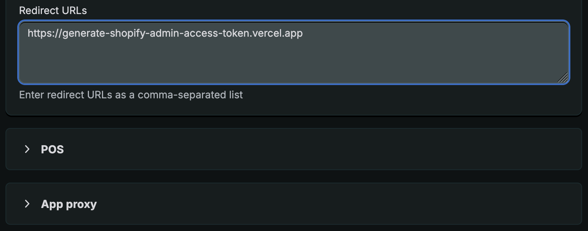
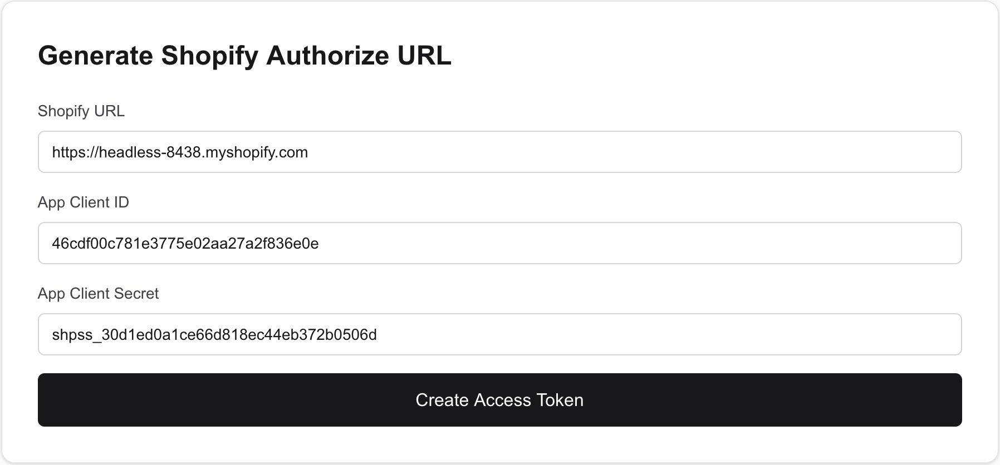
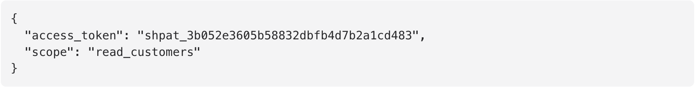

This post explains how you can quickly generate a Shopify admin token for your app.

<!-- truncate -->

## Step 1: Add Redirect URI

Add `https://generate-shopify-admin-access-token.vercel.app` to the list of _Redirect URLs_.

## Step 2: Generate Token

Visit [https://generate-shopify-admin-access-token.vercel.app/](https://generate-shopify-admin-access-token.vercel.app/).

Enter your store domain, your app client id and your app secret.

Submit the details to get your access token.

If you have already installed the app in your store, you will see the admin token immediately. If not, you will be first taken to the screen to install the app. Once you install the app, you will be automatically redirected to `https://generate-shopify-admin-access-token.vercel.app` and admin token will be displayed there.

